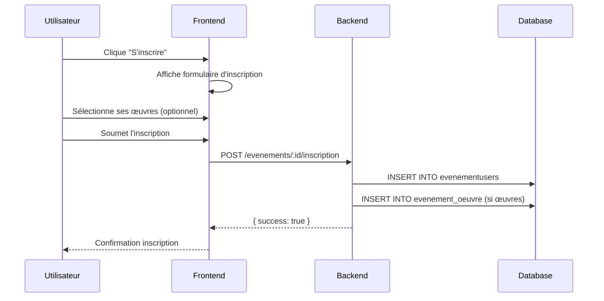
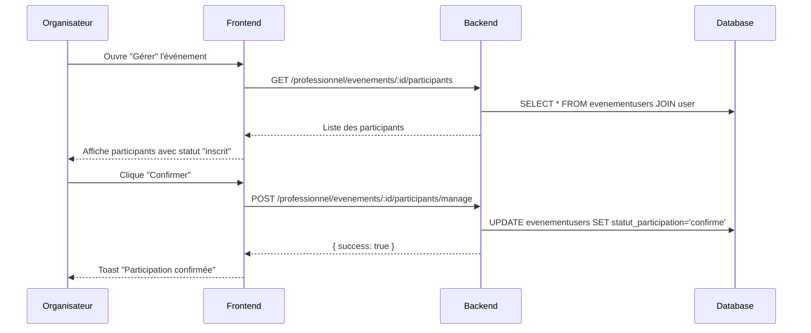

# Documentation - Gestion des Participants et Événements

## Table des matières

1. [Vue d'ensemble](#vue-densemble)
2. [Architecture](#architecture)
3. [Flux d'inscription](#flux-dinscription)
4. [Gestion des participants (Dashboard Pro)](#gestion-des-participants-dashboard-pro)
5. [API Backend](#api-backend)
6. [Modèles de données](#modèles-de-données)
7. [Composants Frontend](#composants-frontend)

---

## Vue d'ensemble

Le système de gestion des participants permet aux professionnels (organisateurs d'événements) de :
- Voir la liste des participants inscrits à leurs événements
- Valider ou refuser les inscriptions
- Consulter les œuvres soumises par chaque participant
- Voir le profil complet et le portfolio des participants
- Marquer la présence/absence le jour de l'événement

### Acteurs

| Rôle | Description |
|------|-------------|
| **Visiteur** | Peut voir les événements publics |
| **Utilisateur inscrit** | Peut s'inscrire aux événements et soumettre des œuvres |
| **Professionnel** | Peut créer des événements et gérer les participants |
| **Admin** | Accès complet à la plateforme |

---

## Architecture

```
┌─────────────────────────────────────────────────────────────────┐
│                        FRONTEND (React)                         │
├─────────────────────────────────────────────────────────────────┤
│  DashboardPro.tsx                                               │
│    └── GestionEvenement.tsx                                     │
│          ├── ParticipantsManager.tsx  ← Gestion participants    │
│          ├── ProgrammeManager.tsx     ← Gestion programmes      │
│          └── OeuvresManager.tsx       ← Gestion œuvres          │
├─────────────────────────────────────────────────────────────────┤
│                        SERVICES                                  │
│  httpClient.ts → professionnelService.ts → API calls            │
├─────────────────────────────────────────────────────────────────┤
│                        BACKEND (Express)                         │
├─────────────────────────────────────────────────────────────────┤
│  Routes: professionnelRoutes.js                                  │
│    └── Controllers: evenementController.js                       │
│          └── ProfessionnelController.js                          │
├─────────────────────────────────────────────────────────────────┤
│                        BASE DE DONNÉES                           │
│  Tables: evenement, evenementusers, evenement_oeuvre, user       │
└─────────────────────────────────────────────────────────────────┘
```

---

## Flux d'inscription

### 1. Inscription d'un participant à un événement



### 2. Validation par l'organisateur



---

## Gestion des participants (Dashboard Pro)

### Accès

1. Connexion avec un compte professionnel
2. Dashboard Pro → Onglet "Événements"
3. Cliquer sur "Gérer" pour un événement
4. Onglet "Participants"

### Fonctionnalités

#### Liste des participants

Affiche pour chaque participant :
- Avatar et nom
- Email
- Statut de participation (inscrit, confirmé, présent, absent, annulé)
- Rôle (participant, intervenant, bénévole, staff)
- Date d'inscription
- Œuvres soumises (badges cliquables)

#### Actions disponibles

| Statut actuel | Actions possibles |
|---------------|-------------------|
| `inscrit` | Confirmer, Refuser |
| `confirme` | Marquer présent, Marquer absent |
| `present` | Badge "Présent" affiché |
| `absent` | Badge "Absent" affiché |
| `annule` | Badge "Annulé" affiché |

#### Consultation des œuvres

Cliquer sur le badge d'une œuvre ouvre un dialogue avec :
- Image principale
- Titre et type d'œuvre
- Auteur/Artiste
- Description complète
- Note spécifique pour l'événement
- Informations techniques (dimensions, matériaux, technique...)
- Champs spécifiques aux livres (éditeur, ISBN, pages...)
- Galerie de médias
- Bouton vers la page complète

#### Consultation du profil

Cliquer sur "Voir profil" ouvre un dialogue avec :
- Informations de contact (email, téléphone, site web)
- Biographie
- Type d'utilisateur
- Organisations
- Inscription à cet événement (statut, rôle, date, notes)
- Œuvres soumises pour cet événement (cliquables)
- Portfolio complet (autres œuvres, cliquables)
- Historique des participations à d'autres événements

---

## API Backend

### Routes professionnelles

Base URL: `/api/professionnel`

#### GET /evenements/:id/participants

Récupère la liste des participants d'un événement.

**Headers requis:**
```
Authorization: Bearer <token>
```

**Réponse:**
```json
{
  "success": true,
  "data": [
    {
      "id_EventUser": 1,
      "id_user": 18,
      "statut_participation": "inscrit",
      "role_participation": "participant",
      "date_inscription": "2025-01-15T10:30:00Z",
      "notes": "Première participation",
      "User": {
        "id_user": 18,
        "nom": "Benali",
        "prenom": "Fatima",
        "email": "fatima@example.com",
        "photo_url": "/uploads/avatars/18.jpg",
        "TypeUser": { "nom_type": "Écrivain" }
      },
      "oeuvres_soumises": [
        {
          "id_oeuvre": 5,
          "titre": { "fr": "Premier Roman", "ar": "الرواية الأولى" },
          "description": { "fr": "Un roman autobiographique..." },
          "TypeOeuvre": { "nom_type": "Livre" }
        }
      ]
    }
  ],
  "stats": {
    "total": 15,
    "par_statut": { "inscrit": 5, "confirme": 8, "present": 2 },
    "par_role": { "participant": 12, "intervenant": 3 }
  }
}
```

#### GET /evenements/:id/participants/:userId/profil

Récupère le profil complet d'un participant.

**Réponse:**
```json
{
  "success": true,
  "data": {
    "profil": {
      "id_user": 18,
      "nom": "Benali",
      "prenom": "Fatima",
      "email": "fatima@example.com",
      "biographie": "Écrivaine algérienne...",
      "photo_url": "/uploads/avatars/18.jpg",
      "site_web": "https://fatima-benali.com",
      "telephone": "+213 555 123 456",
      "TypeUser": { "nom_type": "Écrivain" },
      "Organisations": []
    },
    "inscription": {
      "statut_participation": "inscrit",
      "role_participation": "participant",
      "date_inscription": "2025-01-15T10:30:00Z",
      "notes": null
    },
    "oeuvres_soumises": [...],
    "portfolio": [...],
    "historique_participations": [...]
  }
}
```

#### POST /evenements/:id/participants/manage

Gère le statut d'un participant.

**Body:**
```json
{
  "userId": 18,
  "action": "confirmer",
  "notes": "Bienvenue !"
}
```

**Actions possibles:**
- `confirmer` → statut = `confirme`
- `rejeter` → statut = `annule`
- `marquer_present` → statut = `present`
- `marquer_absent` → statut = `absent`

**Réponse:**
```json
{
  "success": true,
  "message": "Participation confirmée",
  "data": {
    "participation": { ... },
    "participant": {
      "nom": "Benali",
      "prenom": "Fatima",
      "email": "fatima@example.com"
    }
  }
}
```

---

## Modèles de données

### Table `evenementusers`

| Colonne | Type | Description |
|---------|------|-------------|
| `id_EventUser` | INT (PK) | Identifiant unique |
| `id_evenement` | INT (FK) | Référence vers evenement |
| `id_user` | INT (FK) | Référence vers user |
| `role_participation` | ENUM | 'participant', 'organisateur', 'intervenant', 'benevole', 'staff' |
| `statut_participation` | ENUM | 'inscrit', 'confirme', 'present', 'absent', 'annule' |
| `date_inscription` | DATETIME | Date/heure d'inscription |
| `notes` | TEXT | Notes de l'utilisateur |
| `date_validation` | DATETIME | Date de validation par l'organisateur |
| `valide_par` | INT (FK) | ID de l'organisateur qui a validé |
| `evaluation_evenement` | INT | Note 1-5 |
| `commentaire_evaluation` | TEXT | Commentaire de l'utilisateur |
| `presence_confirmee` | BOOLEAN | Présence physique confirmée |
| `certificat_genere` | BOOLEAN | Certificat généré |

### Table `evenement_oeuvre`

| Colonne | Type | Description |
|---------|------|-------------|
| `id_EventOeuvre` | INT (PK) | Identifiant unique |
| `id_evenement` | INT (FK) | Référence vers evenement |
| `id_oeuvre` | INT (FK) | Référence vers oeuvre |
| `id_presentateur` | INT (FK) | Utilisateur qui présente l'œuvre |
| `ordre_presentation` | INT | Ordre de passage |
| `duree_presentation` | INT | Durée en minutes |
| `description_presentation` | TEXT | Note spécifique pour cet événement |

### Relations

```
evenement 1───N evenementusers N───1 user
    │
    └───N evenement_oeuvre N───1 oeuvre
              │
              └───1 user (presentateur)
```

---

## Composants Frontend

### ParticipantsManager.tsx

**Props:**
```typescript
interface ParticipantsManagerProps {
  evenementId: number;
  evenementNom: string;
}
```

**États:**
```typescript
const [participants, setParticipants] = useState<Participant[]>([]);
const [stats, setStats] = useState<Stats | null>(null);
const [loading, setLoading] = useState(true);
const [filterStatut, setFilterStatut] = useState<string>('all');
const [filterRole, setFilterRole] = useState<string>('all');
const [actionLoading, setActionLoading] = useState<number | null>(null);

// Dialogues
const [profilDialogOpen, setProfilDialogOpen] = useState(false);
const [profilData, setProfilData] = useState<ParticipantProfil | null>(null);
const [oeuvreDialogOpen, setOeuvreDialogOpen] = useState(false);
const [selectedOeuvre, setSelectedOeuvre] = useState<OeuvreSoumise | null>(null);
```

**Fonctions principales:**
```typescript
// Charger les participants
loadParticipants(): Promise<void>

// Charger le profil d'un participant
loadParticipantProfil(userId: number): Promise<void>

// Gérer une action (confirmer, rejeter, etc.)
handleParticipantAction(
  userId: number,
  action: 'confirmer' | 'rejeter' | 'marquer_present' | 'marquer_absent',
  notes?: string
): Promise<void>
```

### Interfaces TypeScript

```typescript
interface Participant {
  id_EventUser: number;
  id_user: number;
  statut_participation: string;
  role_participation: string;
  date_inscription: string;
  notes?: string;
  User: {
    id_user: number;
    nom: string;
    prenom: string;
    email: string;
    photo_url?: string;
    TypeUser?: { nom_type: string };
  };
  oeuvres_soumises: OeuvreSoumise[];
}

interface OeuvreSoumise {
  id_oeuvre: number;
  titre: string | MultiLangField;
  description?: string | MultiLangField;
  image_url?: string;
  TypeOeuvre?: { nom_type: string };
  ordre_presentation?: number;
  description_presentation?: string;
  // Champs détaillés
  annee_creation?: number;
  dimensions?: string;
  materiaux?: string;
  technique?: string;
  editeur?: string;
  isbn?: string;
  nombre_pages?: number;
  Medias?: Media[];
}

interface ParticipantProfil {
  profil: UserProfile;
  inscription: InscriptionInfo;
  oeuvres_soumises: OeuvreSoumise[];
  portfolio: OeuvreSoumise[];
  historique_participations: HistoriqueItem[];
}
```

---

## Traductions i18n

Clés de traduction utilisées :

```json
{
  "pro.participants.title": "Participants",
  "pro.participants.viewProfile": "Voir profil",
  "pro.participants.worksSubmitted": "œuvre(s) soumise(s)",
  "pro.participants.registeredOn": "Inscrit le",
  "pro.participants.actions.confirm": "Confirmer",
  "pro.participants.actions.reject": "Refuser",
  "pro.participants.actions.markPresent": "Présent",
  "pro.participants.actions.markAbsent": "Absent",
  "pro.participants.actions.confirmSuccess": "Participation confirmée",
  "pro.participants.actions.rejectSuccess": "Participation refusée",
  "pro.participants.workDetails": "Détails de l'œuvre",
  "pro.participants.author": "Auteur / Artiste",
  "pro.participants.submittedWorks": "Œuvres soumises pour cet événement",
  "pro.participants.portfolio": "Portfolio",
  "pro.participants.eventRegistration": "Inscription à cet événement",
  "pro.participants.participationHistory": "Historique des participations",
  "status.pending": "Inscrit",
  "status.validated": "Confirmé",
  "status.present": "Présent",
  "status.absent": "Absent",
  "status.cancelled": "Annulé",
  "event.roles.participant": "Participant",
  "event.roles.organisateur": "Organisateur",
  "event.roles.intervenant": "Intervenant",
  "event.roles.benevole": "Bénévole",
  "event.roles.staff": "Staff"
}
```

---

## Corrections techniques appliquées

### Noms de colonnes corrigés

| Code original | Colonne réelle | Fichier |
|---------------|----------------|---------|
| `User.photo_profil` | `User.photo_url` | evenementController.js |
| `User.bio` | `User.biographie` | evenementController.js |
| `User.date_inscription` | `User.date_creation` | evenementController.js |
| `Oeuvre.id_user` | `Oeuvre.saisi_par` | evenementController.js |
| `Oeuvre.image_url` | (supprimé - n'existe pas) | evenementController.js |
| `Organisation.logo_url` | (supprimé - n'existe pas) | evenementController.js |

### Cache backend

Le middleware de cache peut stocker des erreurs. Après modification du code, **redémarrer le serveur** pour vider le cache :

```bash
cd backend
npm start
```

---

## Tests recommandés

### Scénario 1 : Inscription et validation

1. Créer un événement avec acceptation des soumissions d'œuvres
2. S'inscrire avec un compte utilisateur et soumettre une œuvre
3. Se connecter avec le compte organisateur
4. Vérifier que le participant apparaît avec statut "inscrit"
5. Cliquer sur "Confirmer" → statut passe à "confirmé"
6. Vérifier le toast de confirmation

### Scénario 2 : Consultation des œuvres

1. Dans la liste des participants, cliquer sur un badge d'œuvre
2. Vérifier que le dialogue s'ouvre avec les détails
3. Vérifier que l'auteur est bien affiché
4. Cliquer sur "Voir page complète" → nouvelle page

### Scénario 3 : Profil complet

1. Cliquer sur "Voir profil" d'un participant
2. Vérifier les informations de contact
3. Cliquer sur une œuvre du portfolio
4. Vérifier que le dialogue d'œuvre s'ouvre

---

## Évolutions futures

- [ ] Export CSV/Excel des participants
- [ ] Envoi d'emails groupés aux participants
- [ ] Génération de badges/certificats
- [ ] QR Code pour check-in rapide
- [ ] Statistiques détaillées de participation
- [ ] Notifications push pour les participants
